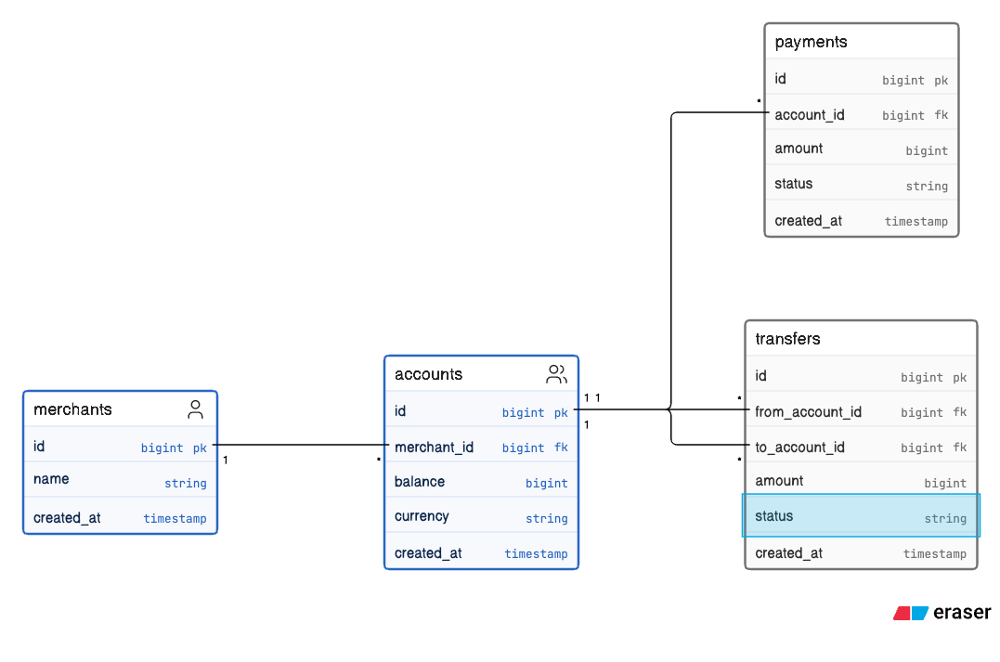
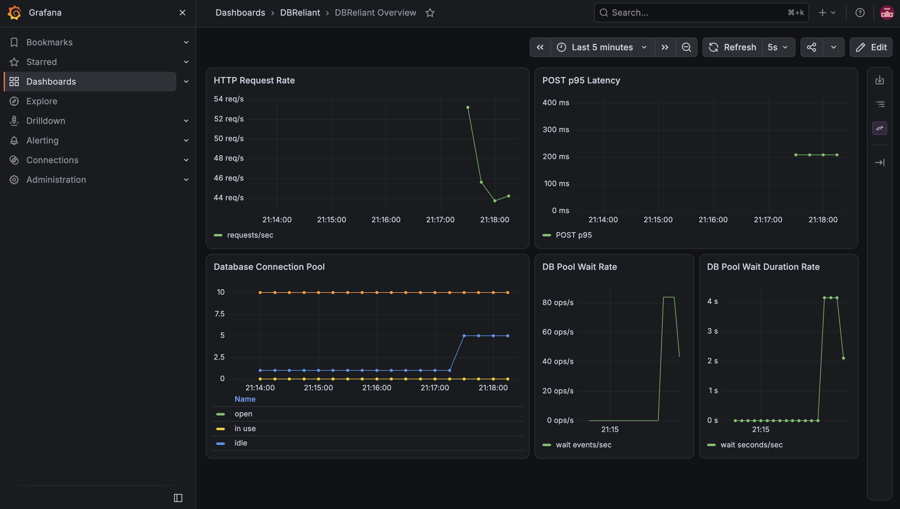

# DBReliant

DBReliant is a Go + PostgreSQL reliability lab for reproducing database failure
modes and validating practical fixes under controlled local workloads.

The project focuses on query optimization, transactions, row locking, connection
pooling, safe schema changes, observability, and concurrent load testing. Results
in this repository are local observations, not production benchmarks.

## Architecture

- Go HTTP API using `database/sql` and pgx
- Configurable `database/sql` connection pool
- PostgreSQL 18 with deterministic payment data
- Prometheus metrics and scraping
- Provisioned Grafana datasource and dashboard
- Configurable concurrent transfer load generator



Monetary values use integer minor units. Timestamps use `TIMESTAMPTZ`.

## APIs

### `POST /transfers`

Executes a transfer in one database transaction. Both account rows are locked
with `SELECT ... FOR UPDATE` in ascending account ID order, regardless of
transfer direction. This avoids the two-account deadlock pattern reproduced in
the locking lab. Insufficient funds returns HTTP `409` without changing either
balance.

```bash
curl -X POST http://localhost:8080/transfers \
  -H "Content-Type: application/json" \
  -d '{"from_account_id":1,"to_account_id":2,"amount":1}'
```

### `GET /payments`

Requires `account_id` and `status`. Supported statuses are `processing`,
`completed`, and `failed`. `limit` defaults to 100 and is capped at 1,000.
Results are ordered by `created_at DESC`.

```bash
curl "http://localhost:8080/payments?account_id=123&status=completed&limit=5"
```

The query uses the `(account_id, status, created_at DESC)` composite B-tree
index for filtering and ordering.

## Reliability Experiments

- [Slow Query / Index Optimization](experiments/slow-query/README.md): replaced
  a parallel sequential scan and sort with an index scan.
- [Deadlock / Row Locking](experiments/deadlock/README.md): reproduced SQLSTATE
  `40P01` and prevented the pattern with deterministic lock ordering.
- [Connection Exhaustion / Pool Backpressure](experiments/connections/README.md):
  compared unbounded and bounded Go connection pools.
- [Unsafe Migration / Online Indexing](experiments/unsafe-migration/README.md):
  compared `CREATE INDEX` with `CREATE INDEX CONCURRENTLY` and observed lock
  queue amplification.
- [HTTP Latency / Prometheus Histogram](experiments/http-latency/README.md):
  validated request counters and histogram-based latency estimates.
- [Transfer API / Load Experiment](experiments/transfer-load/README.md): exercised
  transaction locking, pool backpressure, and hot-row contention.

## Measured Local Results

These are controlled local observations. They should not be treated as
production capacity or latency claims.

### Slow Query

| Metric | Before | After |
| --- | ---: | ---: |
| Median latency | ~51.8 ms | ~1.2 ms |
| Shared buffer hits | 9,321 | 104 |

The test used a 1,000,000-row payments dataset. The optimized plan used the
composite index `(account_id, status, created_at DESC)`.

### Payments Query Validation

For `GET /payments` with `LIMIT 5`, local `EXPLAIN (ANALYZE, BUFFERS)` showed:

- `Index Scan` using `idx_payments_account_status_created_at`
- No explicit `Sort`
- 11 shared buffer hits
- Approximately 0.346 ms execution time
- Approximately 1.861 ms planning time

This validation used a different limit and should not be compared directly with
the earlier `LIMIT 100` slow-query benchmark.

### Transfer Load

```yaml
Endpoint: POST /transfers
Requests: 5,000
Concurrent workers: 50
DB_MAX_OPEN_CONNS: 10
HTTP 201 responses: 5,000
db_wait_count_total: 4,990
db_wait_duration_seconds_total: ~243.25 s
Estimated p50 handler latency: ~46.4 ms
Estimated p95 handler latency: ~210.5 ms
Estimated p99 handler latency: ~249.4 ms
```

`db_wait_count_total` counts `database/sql` connection-pool wait events, not
PostgreSQL row-lock waits or necessarily unique requests. Wait duration is
cumulative across callers. Pool queueing, transaction work, and hot-row locking
all contributed to the observed handler latency.

## Observability

Prometheus scrapes application metrics from `/metrics`. Grafana uses the
provisioned Prometheus datasource to visualize:

- HTTP request rate
- POST p95 handler latency
- Database pool open, in-use, idle, and maximum connections
- Database pool wait rate
- Database pool wait-duration rate



The dashboard demonstrates the expected local behavior:

```text
concurrent load
-> bounded database pool
-> connection-pool queueing
-> increased wait metrics and tail latency
```

## Quick Start

```bash
cp .env.example .env
make setup
make migrate
make seed
make build
make run
```

`make seed` creates 100 merchants, 1,000 accounts, and 100,000 deterministic
payments by default. Override the payment count when needed:

```bash
make seed PAYMENT_COUNT=1000000
```

Local services:

- API: `http://localhost:8080`
- Prometheus: `http://localhost:9090`
- Grafana: `http://localhost:3000`

Useful commands:

```bash
make test
make psql
make down
```

## Repository Structure

```text
cmd/                 API, diagnostic CLI, and load generator entrypoints
internal/            Database, HTTP, metrics, payment, and transfer packages
migrations/          Database schema
scripts/             Deterministic seed data
experiments/         Reliability lab notes and reproduction files
queries/diagnostics/ Reusable PostgreSQL diagnostic queries
monitoring/          Prometheus and Grafana configuration
docs/images/         ERD and dashboard images
```

## Future Work

- Backup and point-in-time recovery exercises
- Replication and high-availability failure scenarios
- SLO definitions and alerting rules
- Additional database failure scenarios
